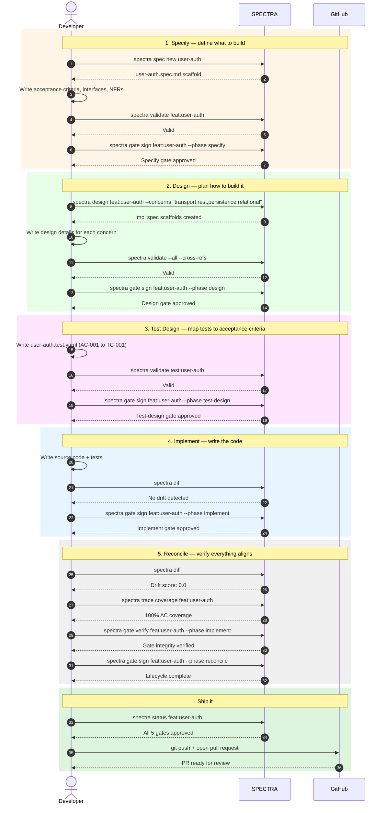

# SPECTRA Workflow

From feature idea to pull request in 5 gated phases.

```
specify → design → test-design → implement → reconcile
```

Each phase must be approved before the next one begins.

## Sequence Diagram



## What each phase does

| Phase | Goal | Key command |
|-------|------|-------------|
| **Specify** | Define acceptance criteria, interfaces, and NFRs | `spectra spec new <name>` |
| **Design** | Break the feature into implementation concerns | `spectra design <id> --concerns "..."` |
| **Test Design** | Map each acceptance criterion to a test case | `spectra validate test:<name>` |
| **Implement** | Write the code, check for drift | `spectra diff` |
| **Reconcile** | Verify full coverage and no drift | `spectra trace coverage <id>` |
