# SPECTRA Workflow Diagram

This sequence diagram illustrates the complete SPECTRA Spec-Driven Development lifecycle — from project initialization through all five gated phases to lifecycle close.

## Participants

| Participant | Role |
|---|---|
| **Developer** | Writes specs, edits code, invokes CLI commands |
| **SPECTRA CLI** | Orchestrates validation, linting, hashing, and gate operations |
| **.spectra/ Filesystem** | Stores specs, impl designs, tests, gates, config, and indexes |
| **Gate System** | Enforces phase ordering via cryptographically signed checkpoints |
| **Constitution** | Defines project-wide constraints injected into generation context |
| **Trace Matrix** | Maintains forward/reverse traceability between specs and artifacts |
| **Drift Engine** | Detects structural, semantic, and constitutional drift |

## Phase Lifecycle

```
specify → design → test-design → implement → reconcile
```

Each phase is blocked until all prior phases have an `approved` gate. Gates are hash-bound to the spec content — editing a spec invalidates all its signed gates, forcing re-approval from the earliest affected phase.

## Sequence Diagram

```mermaid
sequenceDiagram
    autonumber
    actor Dev as Developer
    participant CLI as SPECTRA CLI
    participant FS as .spectra/ Filesystem
    participant Gate as Gate System
    participant Const as Constitution
    participant Trace as Trace Matrix
    participant Drift as Drift Engine

    %% ── Phase 0: Init ──
    rect rgb(240, 240, 255)
        Note over Dev,Drift: Phase 0 — Init (one-time setup)
        Dev->>CLI: spectra init [--claude]
        CLI->>FS: Create directory tree (features/, impl/, tests/, gates/, templates/)
        CLI->>Const: Write constitution.yaml (5 default constraints)
        CLI->>FS: Write config.yaml, constitution.changelog
        CLI->>Trace: Write empty trace.json
        CLI->>FS: Write empty _index.yaml, generate.lock
        CLI-->>Dev: Project initialized
    end

    %% ── Phase 1: Specify ──
    rect rgb(255, 245, 230)
        Note over Dev,Drift: Phase 1 — Specify
        Dev->>CLI: spectra spec new user-auth
        CLI->>FS: Write features/user-auth.spec.md (scaffold)
        CLI->>FS: Rebuild _index.yaml
        CLI-->>Dev: Scaffold created — edit ACs, interfaces, NFRs

        Dev->>Dev: Edit spec (acceptance criteria, interfaces, NFRs)

        Dev->>CLI: spectra validate feat:user-auth
        CLI->>CLI: Zod schema validation
        CLI-->>Dev: Valid

        Dev->>CLI: spectra lint feat:user-auth
        CLI->>CLI: SPEC-001..SPEC-008 quality rules
        CLI-->>Dev: No issues

        Dev->>CLI: spectra spec rehash feat:user-auth
        CLI->>CLI: SHA-256 of canonical JSON (hash field excluded)
        CLI->>FS: Store content_hash in spec

        Dev->>CLI: spectra gate sign feat:user-auth --phase specify
        CLI->>Gate: checkPhaseReady(specify, []) — ready
        CLI->>Gate: signGate() — write feat_user-auth@1.0.0--specify.gate.yaml
        Gate->>Trace: updateGateInTrace(specify = approved)
        CLI-->>Dev: Gate signed
    end

    %% ── Phase 2: Design ──
    rect rgb(230, 255, 230)
        Note over Dev,Drift: Phase 2 — Design
        Dev->>CLI: spectra gate check feat:user-auth --phase design
        CLI->>Gate: checkPhaseReady(design, [specify]) — ready
        CLI-->>Dev: Ready — specify gate approved

        Dev->>CLI: spectra design feat:user-auth --concerns "transport.rest,persistence.relational"
        CLI->>FS: Write impl/user-auth/transport-rest.impl.md
        CLI->>FS: Write impl/user-auth/persistence-relational.impl.md
        CLI-->>Dev: Impl scaffolds created — edit design sections

        Dev->>Dev: Edit impl specs (design descriptions, contracts)

        Dev->>CLI: spectra validate --all --cross-refs
        CLI->>CLI: Validate schemas + check feature_ref resolution
        CLI-->>Dev: Valid

        Dev->>CLI: spectra gate sign feat:user-auth --phase design
        CLI->>Gate: signGate() — write feat_user-auth@1.0.0--design.gate.yaml
        Gate->>Trace: updateGateInTrace(design = approved)
        CLI-->>Dev: Gate signed
    end

    %% ── Phase 3: Test Design ──
    rect rgb(255, 230, 255)
        Note over Dev,Drift: Phase 3 — Test Design
        Dev->>CLI: spectra gate check feat:user-auth --phase test-design
        CLI->>Gate: checkPhaseReady(test-design, [specify, design]) — ready
        CLI-->>Dev: Ready

        Dev->>Dev: Write tests/user-auth.test.yaml (AC-to-TC mapping)

        Dev->>CLI: spectra validate test:user-auth
        CLI->>CLI: Validate TC-to-AC mapping (AC-001 to TC-001)
        CLI-->>Dev: Valid

        Dev->>CLI: spectra trace update
        CLI->>Trace: Rebuild index + update ac_coverage
        CLI-->>Dev: Trace updated

        Dev->>CLI: spectra gate sign feat:user-auth --phase test-design
        CLI->>Gate: signGate() — write feat_user-auth@1.0.0--test-design.gate.yaml
        Gate->>Trace: updateGateInTrace(test-design = approved)
        CLI-->>Dev: Gate signed
    end

    %% ── Phase 4: Implement ──
    rect rgb(230, 245, 255)
        Note over Dev,Drift: Phase 4 — Implement
        Dev->>CLI: spectra gate check feat:user-auth --phase implement
        CLI->>Gate: checkPhaseReady(implement, [specify, design, test-design]) — ready
        CLI-->>Dev: Ready

        Dev->>CLI: spectra spec show feat:user-auth
        CLI->>FS: Load spec + impl specs
        CLI->>Const: selectConstraints(domainTags) — top 5 by score
        Const-->>CLI: Constitutional context injected

        Dev->>Dev: Write source code with trace comments
        Note right of Dev: // @spectra feat:user-auth@1.0.0<br/>// impl:transport.rest gen:a1b2c3d4

        Dev->>CLI: spectra validate feat:user-auth
        CLI-->>Dev: Valid

        Dev->>CLI: spectra lint feat:user-auth
        CLI-->>Dev: No issues

        Dev->>CLI: spectra diff
        CLI->>Drift: Scan source files for @spectra trace comments
        Drift->>Trace: Cross-reference authorized_artifacts
        Drift-->>CLI: Drift report (structural + semantic + constitutional)
        CLI-->>Dev: Drift score: 0.0

        Dev->>CLI: spectra trace update
        CLI->>Trace: Register authorized artifacts + hashes
        CLI-->>Dev: Trace updated

        Dev->>CLI: spectra gate sign feat:user-auth --phase implement
        CLI->>Gate: signGate() — write feat_user-auth@1.0.0--implement.gate.yaml
        Gate->>Trace: updateGateInTrace(implement = approved)
        CLI-->>Dev: Gate signed
    end

    %% ── Phase 5: Reconcile ──
    rect rgb(255, 240, 240)
        Note over Dev,Drift: Phase 5 — Reconcile (lifecycle close)
        Dev->>CLI: spectra gate check feat:user-auth --phase reconcile
        CLI->>Gate: checkPhaseReady(reconcile, [specify..implement]) — ready
        CLI-->>Dev: Ready

        Dev->>CLI: spectra diff
        CLI->>Drift: Full drift analysis
        Drift-->>CLI: Structural + Semantic + Constitutional drift
        CLI-->>Dev: Drift score within threshold

        Dev->>CLI: spectra trace coverage feat:user-auth
        CLI->>Trace: Compute AC coverage from ac_coverage map
        Trace-->>CLI: Coverage = 100%
        CLI-->>Dev: All ACs covered

        Dev->>CLI: spectra trace forward feat:user-auth
        CLI->>Trace: List all authorized artifacts
        Trace-->>CLI: Artifact list with hashes
        CLI-->>Dev: Forward trace verified

        Dev->>CLI: spectra gate verify feat:user-auth --phase implement
        CLI->>Gate: Recompute spec hash — compare to gate.spec_hash
        Gate-->>CLI: Hash match — gate still valid
        CLI-->>Dev: Gate integrity verified

        Dev->>CLI: spectra gate sign feat:user-auth --phase reconcile
        CLI->>Gate: signGate() — write feat_user-auth@1.0.0--reconcile.gate.yaml
        Gate->>Trace: updateGateInTrace(reconcile = approved)
        CLI-->>Dev: Lifecycle complete
    end

    %% ── Hash Invalidation ──
    rect rgb(255, 220, 220)
        Note over Dev,Drift: Hash Invalidation — editing a spec breaks all gates
        Dev->>FS: Edit user-auth.spec.md (change an AC)
        Note right of Dev: Content hash changes — all gates invalidated
        Dev->>CLI: spectra gate verify feat:user-auth --phase specify
        CLI->>Gate: Recompute hash != gate.spec_hash
        Gate-->>CLI: INVALID — spec modified after signing
        CLI-->>Dev: Gate expired — must re-sign from specify phase
    end
```



## Key Invariants

1. **Phase ordering** — Each phase gate must be `approved` before the next phase can begin. `checkPhaseReady()` enforces this using `PHASE_ORDER`.

2. **Hash binding** — Gates store the spec's SHA-256 content hash at signing time. Any edit to the spec invalidates all its gates, requiring re-approval from the earliest affected phase.

3. **Trace comments** — Every generated source file carries a `// @spectra <ref> impl:<concern> gen:<id>` comment. Drift detection depends on these anchors to verify spec-to-code alignment.

4. **Constitutional injection** — The top 5 constraints (scored by domain tag overlap and enforcement priority) are injected into the generation context, ensuring AI-generated code respects project invariants.

5. **Dual-write traceability** — Gate status changes are written both to the gate file (`.spectra/gates/`) and to `trace.json`, maintaining a denormalized cache for fast lookups.
